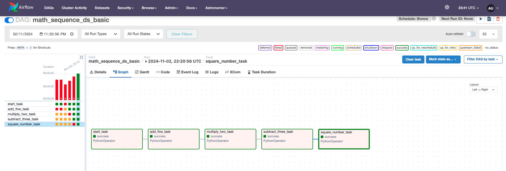
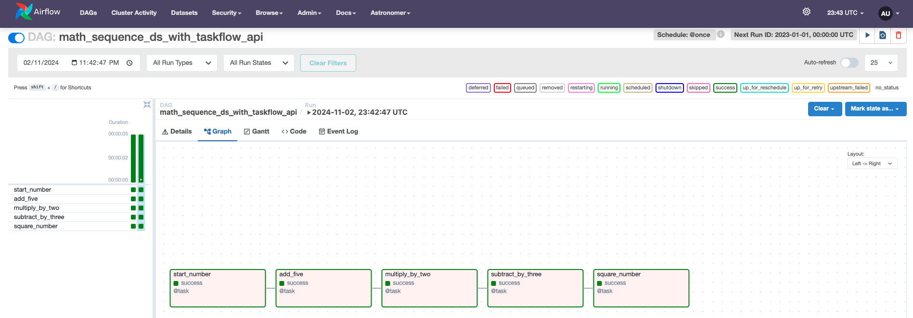
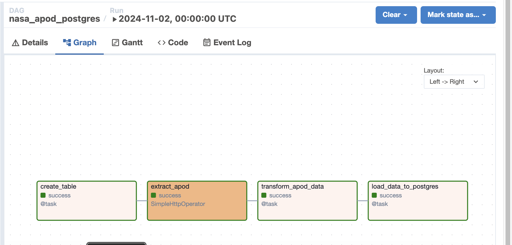

## Airflow Data Pipeline Projects

This repository contains **two mini-projects** and one **big project** demonstrating different approaches and use cases of **Apache Airflow** for building data pipelines. All projects are managed with **Astronomer**, providing a scalable and consistent environment to manage Airflow deployments.

## Project Overview
1. Math Operations Using PythonOperator
2. Math Operations Using TaskFlow API
3. ETL Pipeline with NASA's APOD API

**Note**: Each project is organized in the dags/ directory, highlighting different aspects of Airflow for task orchestration to full ETL pipeline building, and emphasizes best practices in pipeline automation, error handling, and scalability.

## Mini Project 1: Math Operations Using PythonOperator

This mini-project demonstrates mathematical operations using the PythonOperator, with each task defined outside the DAG block and managed explicitly using XCom for data flow.

This mini-project demonstrates mathematical operations using the **PythonOperator**, showcasing how to define tasks and manage data flow between them **explicitly**. **Each function is defined outside the DAG**, and the **XComs are manually handled to pass values between tasks**.

DAG File: dags/maths_operations_by_pythonOperator.py

Key Concepts:
* Manual XCom handling for data sharing between tasks
* Modular task definitions with PythonOperator

Airflow UI Graph:

## Mini Project 2: Math Operations Using TaskFlow API

This mini-project leverages **Airflow’s TaskFlow API**, offering a more streamlined approach to task definition. Using Python decorators, tasks are defined directly within the DAG, and data flow between tasks is automatically managed.

DAG File: dags/math_operations_by_TaskFlow.py
Key Concepts:
* TaskFlow API with @task decorators
* Automatic XCom handling and intuitive data passing

Airflow UI Graph:

## Big Project 3: Automated ETL Pipeline for NASA's APOD with Airflow and PostgreSQL

This project demonstrates a robust ETL (Extract, Transform, Load) pipeline using **Apache Airflow** (A powerful tool for workflow automation) on **Astronomer** (a managed Airflow Service that takes care of the Airflow's installation, scaling, making it easier to scale  Airflow deployment up or down based on the project's processing needs.) and maintenance.) to automate data ingestion and processing from **NASA's Astronomy Picture of the Day (APOD) API**. The ETL pipeline extracts, transforms and loads ingested data into a **PostgreSQL database**, focusing on **scalability** and **modularity**. Airflow, managed by Astronomer, orchestrates the workflow, handling scheduling, monitoring, and error management.

* DAG File: dags/etl.py

### Project Overview

The ETL pipeline performs three main functions:
1. **Extract**: Retrieves daily data from NASA’s APOD API.
2. **Transform**: Cleans and structures the data.
3. **Load**: Stores the processed data in PostgreSQL.

**Docker Compose** is used to run the PostgreSQL container, while **Astronomer** manages the Airflow container. Both containers are connected via a shared network, ensuring reliable data flow and seamless integration between Airflow and PostgreSQL.

### Key Components

1. **Apache Airflow on Astronomer** for ETL Orchestration
   - Airflow, managed by Astronomer, defines the DAG (Directed Acyclic Graph) to coordinate task dependencies and ensure data integrity.
   - Automates ETL tasks, including extraction, transformation, and loading.

2. **PostgreSQL Database**
   - Stores processed data in a Dockerized PostgreSQL container, orchestrated via Docker Compose.
   - Integrated with Airflow using PostgresHook and PostgresOperator, facilitating table creation and data insertion.

3. **NASA’s APOD API**
   - Serves as the external data source, providing daily astronomy data, including metadata like title, description, and image URL.
   - Data is extracted via Airflow’s SimpleHttpOperator.

### Workflow

1. **Extract Stage**:
   - Uses **SimpleHttpOperator** to fetch data from NASA's APOD API in JSON format.

2. **Transform Stage**:
   - Processes the JSON response with Airflow’s TaskFlow API, extracting relevant fields (title, description, URL, date) and formatting them for database storage.

3. **Load Stage**:
   - Inserts cleaned data into PostgreSQL via PostgresHook, creating tables if they do not already exist.

### Architecture and Technology Stack

- **Apache Airflow on Astronomer**: Defines, schedules, and monitors workflows within the Astronomer-managed environment.
- **Docker and Docker Compose**: Astronomer manages the Airflow container, while Docker Compose runs the PostgreSQL container. Both containers connect via a shared network.
- **PostgreSQL**: Provides persistent, structured data storage.
- **NASA’s APOD API**: Supplies daily astronomy-related content.

### Visuals

- **Airflow UI Graph**:  
  

- **Airflow Connections**:  
  

### How to Run the Project

1. **Set Up Docker**: Use Docker Compose to start the PostgreSQL container. Ensure it shares a common network with the Airflow container managed by Astronomer for seamless connectivity.
2. **Configure API Key**: Add the NASA API key as an environment or Airflow variable for secure access.
3. **Initialize Database**: Airflow will create required tables if they don’t exist.
4. **Run the DAG**: Trigger the DAG in Airflow, which will sequentially execute ETL tasks.

This project demonstrates comprehensive data engineering, orchestration, and API integration skills, with a scalable and reliable ETL pipeline managed within Astronomer’s Airflow environment, connected seamlessly to a PostgreSQL instance via Docker.